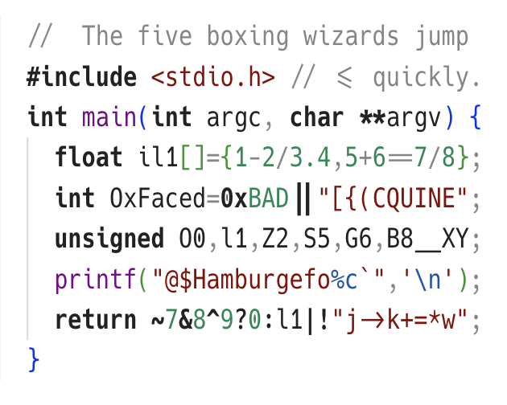

# Hacksta Font

A condensed version of [Ligatured Hack](https://github.com/gaplo917/Ligatured-Hack) using Fira Code glyphs.

[regular](https://bulletproof.italic.space/lettering?preload=https%3A%2F%2Fraw.githubusercontent.com%2Fshytikov%2Fhacksta%2Fmain%2Fdist%2FHacksta-Regular.ttf) /
[bold](https://bulletproof.italic.space/lettering?preload=https%3A%2F%2Fraw.githubusercontent.com%2Fshytikov%2Fhacksta%2Fmain%2Fdist%2FHacksta-Bold.ttf) /
[italic](https://bulletproof.italic.space/lettering?preload=https%3A%2F%2Fraw.githubusercontent.com%2Fshytikov%2Fhacksta%2Fmain%2Fdist%2FHacksta-Italic.ttf) /
[bold-italic](https://bulletproof.italic.space/lettering?preload=https%3A%2F%2Fraw.githubusercontent.com%2Fshytikov%2Fhacksta%2Fmain%2Fdist%2FHacksta-BoldItalic.ttf)

## The story

Oops I did it again... After [condensing Cascadia Code](https://github.com/shytikov/casmatapro), which worked so well for me, I decided to try it once more, now with [Hack](https://github.com/source-foundry/Hack).

Hack is notoriously boring, and intentionally average looking. You cannot say anythig exceptionally good about it, except the fact, you cannot find anything bad.

It's a workhorse of a font, that does its job in any situation. And now even in more compact form!

## Installation

Just grab files from `./dist/` folder
